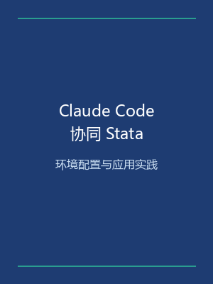

# Claude Code 协同 Stata：环境配置与应用实践 {.unnumbered}

**黎佳迅**，中山大学岭南学院硕士研究生，研究方向为公司金融。曾担任连享会 [寒假班](https://www.lianxh.cn/details/1292.html) 助教。

## 内容提要

AI Agent 能够显著提升科研效率，实现多步骤任务的自动化执行。但在初次使用 Claude Code 时，无法识别 Stata 软件位置或路径解析失败是常见的配置问题。本书的目的是介绍两种简便的 Stata 配置方案以及 Claude Code 的基本使用技巧，帮助经管研究者将 Claude Code 顺利应用到 Stata 实证流程中。

### 本书涵盖内容

- **Stata 环境配置的两种方案**
  - 在 `CLAUDE.md` 中配置项目全局规则
  - 利用 Stata-MCP 实现 AI 与 Stata 的自动连接
- **Claude Code 基本交互技巧**
  - 执行权限控制
  - 发现、安装并管理官方及第三方技能包
  - 查看与恢复历史会话
  - 其他常用斜杠命令（Slash Commands）
- **数据处理和 Skill 生成演示**
  - 演示 "先计划、后执行" 的数据处理全过程
  - 将数据处理流程总结为可复用的 Skill

### 导航

  [连享会主页](https://www.lianxh.cn) \|\| [GitHub 仓库](https://github.com/jasonli357/quarto_book)